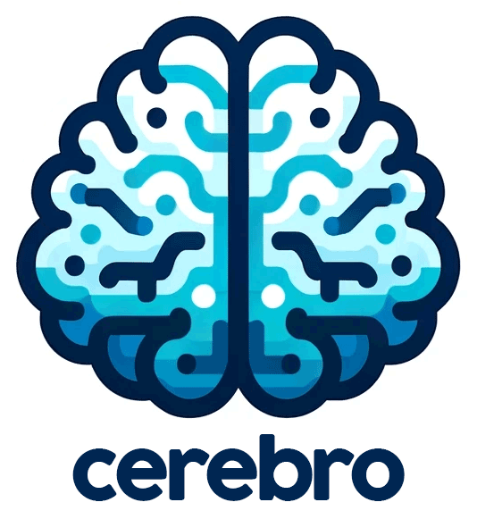

<p align="center">
    
</p>

# Ceérebro - Bot Telegram

Cerebro é um bot do Telegram que tem o objetigo de ser seu segundo cerebro por meio do processamento de linguagem natural e inteligência artificial. Ele utiliza a LLMs para interpretar entradas de voz e texto, facilitando uma experiência única para alavancar seu potencial. Ideal para criadores, escritores e qualquer pessoa que deseje explorar e expandir suas ideias, o Cérebro atua como um parceiro usando ferramenta de inteligência artificial.

## Descrição


Principais Características já implementadas:
- Processamento de entradas de voz e texto
- Identificação e categorização de ideias
- Sessão de brainstorming automatizada com base nas ideias identificadas
- Armazenamento persistente de ideias e sessões para referência futura
- Modelo de interação flexível, apoiando tanto a exploração imediata quanto adiada das ideias

## Instalação

### Pré-requisitos

- Python 3.x
- Uma conta no Telegram

### Criando Seu Bot do Telegram com o BotFather

1. **Inicie o BotFather**: No Telegram, procure pela conta do BotFather (@BotFather), o bot oficial para criar e gerenciar bots do Telegram.

2. **Crie um Novo Bot**: Envie `/newbot` para o BotFather e siga as instruções. Você precisará fornecer um nome e um nome de usuário único para o seu bot.

3. **Obtenha o Token da API**: Após a criação bem-sucedida, o BotFather fornecerá um token da API para o seu novo bot. Esse token permite que seu bot se comunique com a API do Telegram.

4. **Configure o Cérebro**: Coloque o token da API no arquivo `secrets_cerebro.py` sob a variável apropriada.

### Configuração

Siga os passos na seção de Configuração para clonar o projeto, instalar dependências e configurar seu ambiente.

### Configuração

1. **Copie os arquivos do projeto**: Baixe os arquivos projeto para sua máquina local e salve em uma pasta.
```sh
git clone https://github.com/mumunha/cerebro.git
```

2. **Navegue até o Diretório do Projeto**:

```sh
cd [nome-do-diretório-do-projeto]
```
3. **Configure o Ambiente Python (Opcional, mas recomendado)**: Use um ambiente virtual para evitar conflitos com outros projetos.

macOS/Linux:
```sh
python3 -m venv env
source env/bin/activate
```
Windows:

No prompt de comando ou no terminal do vscode.

Crie o ambiente virtual
```sh
python -m venv venv
```
Ative o ambiente virtual
Se for no <b>vscode</b> ou <b>PowerShell</b>
```sh
.\venv\Scripts\Activate.ps1
```
Se for no <b>prompt de comando</b>
```sh
.\venv\Scripts\activate.bat
```
4. **Instale as Dependências**: Instale os requisitos do projeto.

```sh
pip install -r requirements.txt
```

5. **Configuração de APIs**: Renomeie `secrets_cerebro.py.example` para `secrets_cerebro.py` e preencha-o com suas chaves de API do Telegram e OpenAI conforme necessário.

6. **Inicialização do Banco de Dados**: A primeira execução do `cerebro.py` configurará automaticamente o banco de dados SQLite necessário (`cerebro.db`) para armazenar dados da sessão.

## Executando o Cérebro

Execute `cerebro.py` para iniciar o bot:
```sh
python cerebro.py
```
Isso ativará o Cerebro na sua conta do Telegram, pronto para receber e processar suas entradas. Da primeira vez que você tentar conversar com o Cerebro ele não identificará você.

## Uso

- **Captura de Ideias por Voz**: Envie uma mensagem de voz para o Cérebro com sua ideia, e ele a processará e perguntará se você deseja fazer um brainstorming sobre essa ideia.
- **Entrada de Texto**: Envie mensagens de texto para ideias rápidas ou comandos para gerenciar suas sessões de ideias.
- **Sessões de Brainstorming**: Siga as instruções do bot para explorar e expandir suas ideias.

## Ideias para implementação futura

- **Gestão de aniversários**: Sempre esqueço de algumas datas, gostaria de ajuda pra me lembrar e eventualmente escrever mensagens personalizadas
- **Adicionar elementos às ideias existentes**: Permitir ao usuário complementar elementos às ideias existentes
- **Incorporar agentes (crewAI) para realização de tarefas específicas**

## Contribuindo

Contribuições para o Cerebro são bem-vindas! Faça um fork do repositório e submeta um pull request com suas melhorias.

## Licença

Este projeto é de código aberto sob a Licença MIT. Veja o arquivo LICENSE para mais detalhes.
